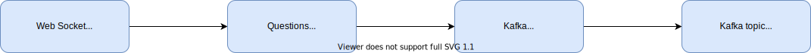
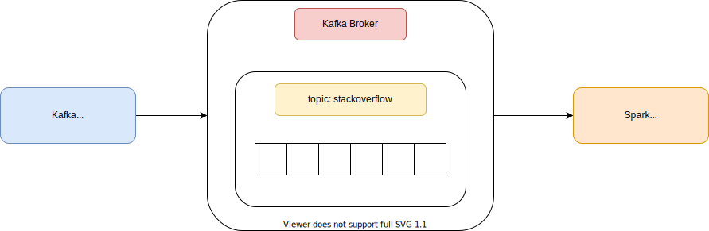
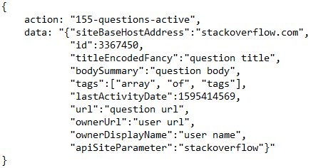

# Data Ingestion and Data Streaming

## What is Apache Kafka?


<a href="https://kafka.apache.org/intro">Apache Kafka</a> is a distributed streaming platform that handle constant real-time data stream.

Kafka has three key capabilities:

- Publish and subscribe to streams of records, similar to a message queue or enterprise messaging system.
- Store streams of records in a fault-tolerant durable way.
- Process streams of records as they occur.

Kafka is generally used for two broad classes of applications:

- Building real-time streaming data pipelines that reliably get data between systems or applications.
- Building real-time streaming applications that transform or react to the streams of data.

Kafka runs as a cluster on one or more servers that can span multiple datacenters.
The Kafka cluster stores streams of records in categories called **topics**. Each record consists of a key, a value, and a timestamp. Data inside a topic can be divided into multiple partitions.

Kafka includes <a href="https://kafka.apache.org/documentation.html#connect">Connector API</a> that allows building and running reusable producers or consumers that connect Kafka topics to existing applications or data systems.

## Kafka Connector


The Kafka Connector is used for the process of Data Ingestion. A web socket module connects to the Stack Exchange web socket and filters the data received from the Stack Overflow domain only. Then, a record will be written into the Blocking Queue, named *QuestionsQueue*. The Connector will read record from QuestionsQueue and it will write them into the Kafka topic, named *stackoverflow*.





The Kafka Connector was built using Java 11 and <a href="https://maven.apache.org/">Apache Maven</a>.

### Kafka properties

Kafka properties are set up in **worker.properties** and **source-setup.properties** files.

### Maven Dependencies

```xml
<dependencies>
    <dependency>
    	<groupId>org.apache.kafka</groupId>
    	<artifactId>connect-api</artifactId>
    	<version>2.4.1</version>
    </dependency>
    <dependency>
    	<groupId>com.squareup.okhttp3</groupId>
    	<artifactId>okhttp</artifactId>
    	<version>4.7.2</version>
    </dependency>
    <dependency>
    	<groupId>org.json</groupId>
    	<artifactId>json</artifactId>
    	<version>20200518</version>
    </dependency>
</dependencies>
```

### Retrieving data

Data are retrieved from Stack Exchange web socket, filtered by domain and written on _QuestionsQueue_.

```java

    @Override
    public void onOpen(WebSocket webSocket, Response response) {
    	queue = QuestionsQueue.getInstance();
    	webSocket.send(request);
    }

    @Override
    public void onMessage(WebSocket webSocket, String text) {
    	JSONObject response = new JSONObject(text);
    	if(response.getString("action").equals("hb"))
    		webSocket.send(heartbeat);
    	else
    		filterResponse(response);
    }

    private void addQuestionToQueue(String data) {
    	try {
    		queue.addQuestion(data);
    	} catch (JSONException e) {
    		e.printStackTrace();
    	}
    }

    private void filterResponse(JSONObject response) {
    	String data = response.getString("data");
    	JSONObject dataJson = new JSONObject(data);
    	String questionSite = dataJson.getString("apiSiteParameter");
    	if(questionSite.equals("stackoverflow"))
    		addQuestionToQueue(data);
    }

```

The web socket address is: <code>wss://qa.sockets.stackexchange.com/</code>

As soon as the connection is open, the Connector sends a request of subscription for the client in order to receive specific type of data.<br>
In this case, the request code is <code>155-questions-active</code>. This will retrieve real-time questions from all sites of Stack Exchange network.

Requests available:

- _[userid]-topbar_: User topbar.
- _[userid]-inbox_: User inbox/achievements.
- _[siteid]-[userid]-reputation_: User's reputation on a site.
- _[siteid]-home-active_: Socket for homepage updates.
- _[siteid]-questions-newest_: For the "newest" page (only new questions).
- _[siteid]-questions-newest-tag-[tagname]_: Newest for a specific tag.
- _[siteid]-questions-active-tag-[tagname]_: Active for a specific tag.
- _[siteid]-question-[questionid]_: Updates for a question.

It is possible to unsubscribe from an event by prepending a single dash before the request code.

To find the site id, it is possible to parse <a href="https://meta.stackexchange.com/topbar/site-switcher/site-list">this page</a>. The site id **155** refers to Stack Exchange.

#### Data example



#### Heartbeat

Every 5 minutes, the socket sends a heartbeat request. If the client replys with heartbeat response, the connection will be kept alive.

Heartbeat request:
<code>
{"action":"hb", "data":"pong"}
</code>

Heartbeat response: ```pong```

### Source Connector

To create a Source Kafka Connector two classes are needed: 
- One that extends **SourceConnector**, responsible of configuring and creating the SourceTask(s);
- One that extends **SourceTask**, responsible of getting the effective work done and writing the data into the Kafka topic.

```java
public class StackoflwSourceConnector extends SourceConnector{

    private String wssURI;
    private String kafkaTopicName;
    private WSSClient wssClient;

    @Override
    public void start(Map<String, String> props) {
    	wssURI = props.get("wss");
    	kafkaTopicName = props.get("topic");
    	wssClient = new WSSClient(wssURI);
    	wssClient.start();
    }

    @Override
    public List<Map<String, String>> taskConfigs(int maxTasks) {
    	List<Map<String, String>> configs = new ArrayList<>();
    	Map<String, String> config = new HashMap<>();
    	config.put("topic", kafkaTopicName);
    	configs.add(config);
    	return configs;
    }

    @Override
    public ConfigDef config() {
    	return new ConfigDef()
    			.define("wss", Type.STRING, Importance.HIGH, "Stackoverflow WSS URL")
    			.define("topic", Type.STRING, Importance.HIGH, "Kafka Topic Name");
    }

}
```

```java
public class StackoflwSourceTask extends SourceTask{

	private final String OFFSET_KEY = "Stackoverflow WSS";
	private String kafkaTopicName;
	private QuestionsQueue queue;
	private Long count;

	@Override
	public void start(Map<String, String> props) {
		kafkaTopicName = props.get("topic");
		queue = QuestionsQueue.getInstance();
		count = 0L;
	}

	@Override
	public List<SourceRecord> poll() throws InterruptedException {
		List<SourceRecord> recordsList = new ArrayList<>();
		while(!queue.isEmpty()) {
			String question = queue.readQuestion();
			SourceRecord record = new SourceRecord(offsetKey(OFFSET_KEY), offsetValue(count++), kafkaTopicName, Schema.STRING_SCHEMA, question);
			recordsList.add(record);
		}
		return recordsList;
	}
}
```
The **poll()** method of the SourceTask is called periodically (every 3 seconds by default) by Kafka Connect. It is responsible of returning a list of SourceRecord elements that will be written to the Kafka topic.

## Build Kafka Connector

Run the following command ```bash build-connector.sh``` inside Kafka/Setup directory to build the Kafka Connector.

## Docker container information

- **Name**: stackoflw-kafka
- **IP Address**: 10.0.100.25
- **Ports**: 9092:9092