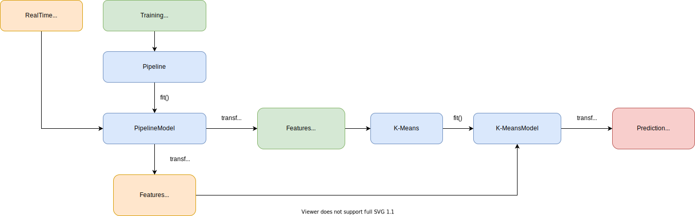
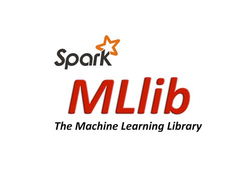
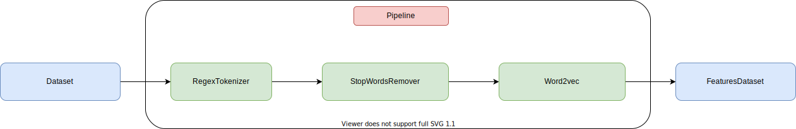

# Data Processing



## What is Apache Spark?


<a href="https://spark.apache.org/docs/latest/">Apache Spark</a> is a unified analytics engine for large-scale data processing. It provides high-level APIs in Java, Scala, Python and R, and an optimized engine that supports general execution graphs. It also supports a rich set of higher-level tools including Spark SQL for SQL and structured data processing, **MLlib** for machine learning, GraphX for graph processing, and Structured Streaming for incremental computation and stream processing.

## What is Spark MLlib?



<a href="https://spark.apache.org/docs/latest/ml-guide.html">Spark MLlib</a> is a Machine Learning library of Spark ecosystem. It provides multiple and various machine learning algorithms, making them scalable and easy to use.

Type of algorithms provided:

- **ML Algorithms**: common learning algorithms such as classification, regression, clustering, and collaborative filtering.
- **Featurization**: feature extraction, transformation, dimensionality reduction, and selection.
- **Pipelines**: tools for constructing, evaluating, and tuning ML Pipelines.
- **Persistence**: saving and load algorithms, models, and Pipelines.
- **Utilities**: linear algebra, statistics, data handling, etc.

## What is Spark Streaming?


<a href="https://spark.apache.org/docs/latest/streaming-programming-guide.html">Apache Spark Streaming</a> is a scalable fault-tolerant streaming processing system that natively supports both batch and streaming workloads. Spark Streaming is an extension of the core Spark API that allows data engineers and data scientists to process real-time data from various sources, including Kafka. This processed data can be pushed out to file systems, databases, and live dashboards.

## Spark Consumer

It was built usign Spark 3.0.0, Java 11 and <a href="https://maven.apache.org/">Apache Maven</a>.

### Maven Dependencies

```xml
  <dependencies>
        <dependency>
			<groupId>org.apache.spark</groupId>
			<artifactId>spark-core_2.12</artifactId>
			<version>3.0.0</version>
			<scope>provided</scope>
		</dependency>
		<dependency>
			<groupId>org.apache.spark</groupId>
			<artifactId>spark-streaming_2.12</artifactId>
			<version>3.0.0</version>
			<scope>provided</scope>
		</dependency>
		<dependency>
			<groupId>org.apache.spark</groupId>
			<artifactId>spark-sql_2.12</artifactId>
			<version>3.0.0</version>
			<scope>provided</scope>
		</dependency>
		<dependency>
			<groupId>org.apache.spark</groupId>
			<artifactId>spark-streaming-kafka-0-10_2.12</artifactId>
			<version>3.0.0</version>
		</dependency>
		<dependency>
            <groupId>org.apache.spark</groupId>
            <artifactId>spark-mllib_2.12</artifactId>
            <version>3.0.0</version>
        </dependency>
		<dependency>
			<groupId>org.json</groupId>
			<artifactId>json</artifactId>
			<version>20200518</version>
		</dependency>
		<dependency>
			<groupId>org.elasticsearch</groupId>
			<artifactId>elasticsearch-hadoop</artifactId>
			<version>7.8.0</version>
		</dependency>
  </dependencies>
```

### Retrieving data from Kafka

The streaming is configured to read from Kafka topic _stackoverflow_, preparing data for being processed.

```java

JavaInputDStream<ConsumerRecord<String, String>> directStream = KafkaUtils.createDirectStream(
				jsc,
				LocationStrategies.PreferConsistent(),
				ConsumerStrategies.Subscribe(getTopicSet(), getKafkaParams()));

directStream.mapToPair(record -> new Tuple2<>(record.key(), record.value())).map(tuple2 -> tuple2._2)
					.foreachRDD(rdd -> predictDataset(rdd));

jsc.start();
jsc.awaitTermination();

```

### Training Dataset

This project uses a training dataset of 1000 questions written in `trainingDataset.txt` located in `Spark/Setup` directory. The Consumer read the data using JSON format and parse them into a Dataset.

### Pipeline

Before passing data to clustering algorithm, they are need to be prepared.<br>
A <a href="https://spark.apache.org/docs/latest/ml-pipeline.html">Pipeline</a> is specified as a sequence of stages, and each one is either a **Transformer** or an **Estimator**.

A **Transformer** is an abstraction that includes feature transformers and learned models. It implements a method **transform()**, which converts one DataFrame into another, generally by appending one or more columns.

An **Estimator** abstracts the concept of a learning algorithm or any algorithm that fits or trains on data. It implements a method **fit()**, which accepts a DataFrame and produces a Model, which is a Transformer.



```java
        RegexTokenizer titleTokenizer = new RegexTokenizer()
				.setInputCol("titleEncodedFancy")
				.setOutputCol("titleTokenized")
				.setPattern("\\W");

		RegexTokenizer bodyTokenizer = new RegexTokenizer()
				.setInputCol("bodySummary")
				.setOutputCol("bodyTokenized")
				.setPattern("\\W");

		StopWordsRemover titleStopWordsRemover = new StopWordsRemover()
				.setInputCol(titleTokenizer.getOutputCol())
				.setOutputCol("titleCleaned");

		StopWordsRemover bodyStopWordsRemover = new StopWordsRemover()
				.setInputCol(bodyTokenizer.getOutputCol())
				.setOutputCol("bodyCleaned");

		Word2Vec title2vec = new Word2Vec()
				.setInputCol(titleStopWordsRemover.getOutputCol())
				.setOutputCol("title2vec")
				.setVectorSize(100)
				.setMinCount(2)
				.setWindowSize(1);

		Word2Vec body2vec = new Word2Vec()
				.setInputCol(bodyStopWordsRemover.getOutputCol())
				.setOutputCol("body2vec")
				.setVectorSize(100)
				.setMinCount(2)
				.setWindowSize(1);

		Word2Vec tags2vec = new Word2Vec()
				.setInputCol("tags")
				.setOutputCol("tags2vec")
				.setVectorSize(100)
				.setMinCount(0)
				.setWindowSize(1);

		PipelineStage[] stages = {titleTokenizer, bodyTokenizer, titleStopWordsRemover, bodyStopWordsRemover, title2vec, body2vec, tags2vec};
        Pipeline pipeline = new Pipeline().setStages(getStages());
```
These stages are run in order, and the input DataFrame is transformed as it passes through each stage. For Transformer stages, the **transform()** method is called on the DataFrame. For Estimator stages, the **fit()** method is called to produce a Transformer.

First, the pipeline receives in input the training dataset using **fit()** method and producing a PipelineModel in output.

The PipelineModel has the **transform()** method. It receives in input the training dataset to produce the dataset transformed that will be used to train the clustering algorithm.<br>
The same PipelineModel object is used to transform dataset containing real-time questions.

### Word2vec stages

<a href="https://spark.apache.org/docs/latest/ml-features.html#word2vec">Word2Vec</a> is an **Estimator** which takes sequences of words representing documents and trains a Word2VecModel. The model maps each word to a unique fixed-size vector (size 100 in this project). The Word2VecModel is a **Transformer** that transforms each document into a vector using the average of all words in the document; this vector can then be used as features for prediction.

- ```setMinCount()```, set the minimum number of times a token must appear to be included in the word2vec model's vocabulary.
- ```setWindowSize()```, set the number of near words that influences the current word.

### Clustering

Before applying the algorithm, datasets need to build a special column named **features**. This is done with a VectorAssembler object.

```java
VectorAssembler assembler = new VectorAssembler()
		        .setInputCols(new String[] {"tags2vec", "title2vec", "body2vec"})
		        .setOutputCol("features");
Dataset<Row> featuresDataset = assembler.transform(dataset);
```

Clustering is the process of grouping similar entities together. The goal of this **unsupervised** machine learning technique is to find similarities in the data point and group similar data points together.

It is an unsupervised technique because it looks in a dataset with no pre-existing labels.

There are many algorithms developed to implement this technique and provided by MLlib. In this project, it is implemented the **K-Means** algorithm.

### K-Means

K-Means is the most popular clustering algorithm, based on centroids calculation. It clusters the data points into a predefined number of clusters.


**K** is the number of clusters the algorithm should use. Using the euclidean distance between data points and centroids, it assign each data point to the cluster which is close to it. Recalculate the cluster centers as a mean of data points assigned to it. Repeat until no further changes occur.

#### How can be found the value of K?

The most popular method is called **Elbow**, but unfortunately could not be applyied to this project.

Instead, it was used the **Silhouette analysis**. The Silhouette score is a measure of how close each point in one cluster is to points in the neighboring clusters. This measure has a range of [-1, 1].<br>
Silhouette coefficients near +1 indicate that the sample is far away from the neighboring clusters. A value of 0 indicates that the sample is on or very close to the decision boundary between two neighboring clusters and negative values indicate that those samples might have been assigned to the wrong cluster.

```java
ClusteringEvaluator evaluator = new ClusteringEvaluator();
double silhouette = evaluator.evaluate(predictDataset);
```

It was found a trade off about **K = 10** and **silhouette = 0.40**

#### Training K-Means

To train the algorithm it was used the training dataset transformed by the pipeline and VectorAssembler. KMeans is an Estimator that produces KMeansModel that is a Transformer.

```java
KMeans kmeans = new KMeans().setK(10).setSeed(10);
KMeansModel kmeansModel = kmeans.fit(featuresDataset);
```

#### Predictions

To predict which cluster data belongs to, real-time dataset is passed to **transform()** method of KMeansModel. It will add a special column named **prediction** that contains an integer, indicating the number of cluster.

```java
Dataset<Row> predictionDataset = kmeansModel.transform(realtimeDataset);
```

## Writing results on Elasticsearch

The dataset resulting from K-Means algorithm is written to Elasticsearch in JSON format.

```java
JavaEsSpark.saveJsonToEs(predictionDataset.toJSON().toJavaRDD(), "es/stackoflw");
```

## Build Spark Consumer

Run ```bash build-consumer.sh``` command inside Spark/Setup directory to build the Spark Consumer.

## Docker container information

- **Name**: stackoflw-spark
- **IP Address**: 10.0.100.42
- **Ports**: 9092:9092
