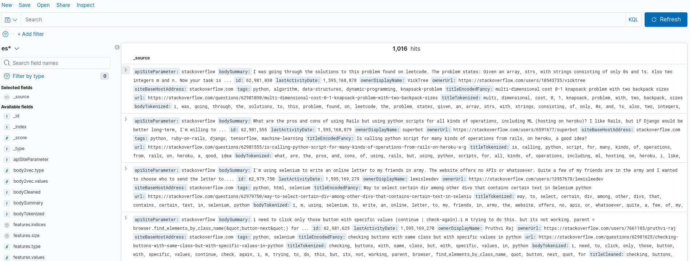
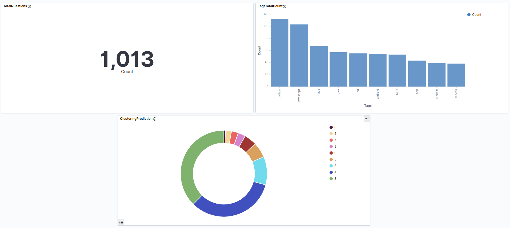
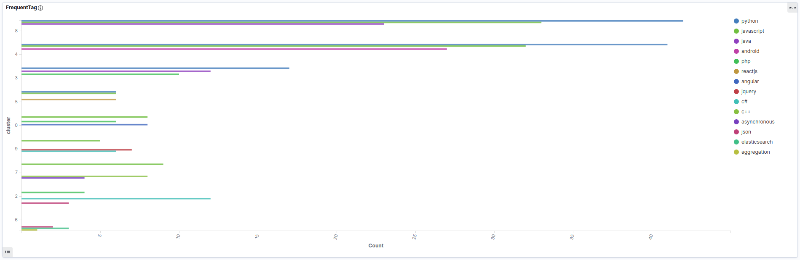

# Kibana


## What is Kibana?

<a href="https://www.elastic.co/what-is/kibana">Kibana</a> is an open source frontend application that sits on top of the Elastic Stack, providing search and data visualization capabilities for data indexed in Elasticsearch. Commonly known as the charting tool for the Elastic Stack, Kibana also acts as the user interface for monitoring, managing, and securing an Elastic Stack cluster.

## How Kibana works?

From browser, go to http://10.0.100.52:5601/ to access Elastic home page. If errors occur about "Impossible to reach the site", it means that Kibana server haven't started yet, so just wait and refresh.

### Discovering data

From left menù, select <code>Kibana -> Discover</code> to visualize the data indexed by Elasticsearch, like example below.



If it's the first time, you will have to create an index.
<br>Go to <code>Stack management -> Kibana -> Index Patterns</code>, click on *Create index pattern* and follow instructions.

### Dashboards

Creating dashboards is very simple.
<br>Go to <code>Kibana -> Dashboard</code> and click on ```Create new```. From the list, you can choose many types of diagrams to create.

Do not forget to save each diagram and the entire dashboard from top left buttons.

### Dashboards example



## Docker container information

- **Name**: stackoflw-kibana
- **IP Address**: 10.0.100.52
- **Ports**: 5601:5601 