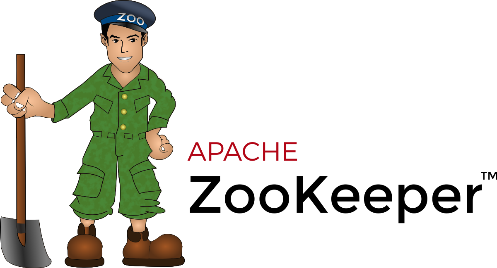

# Zookeeper

## What is Zookeeper?

<a href="https://zookeeper.apache.org/">Zookeeper</a> is a centralized service for maintaining configuration information, naming, providing distributed synchronization, and providing group services. All of these kinds of services are used in some form or another by distributed applications. Each time they are implemented there is a lot of work that goes into fixing the bugs and race conditions that are inevitable. Because of the difficulty of implementing these kinds of services, applications initially usually skimp on them, which make them brittle in the presence of change and difficult to manage. Even when done correctly, different implementations of these services lead to management complexity when the applications are deployed.

In this project, Zookeeper maintains the configuration between Kafka, Kafka-connector and Spark.

## Docker container information

- **Name**: stackoflw-zookeeper
- **IP Address**: 10.0.100.22
- **Ports**: 2181:2181